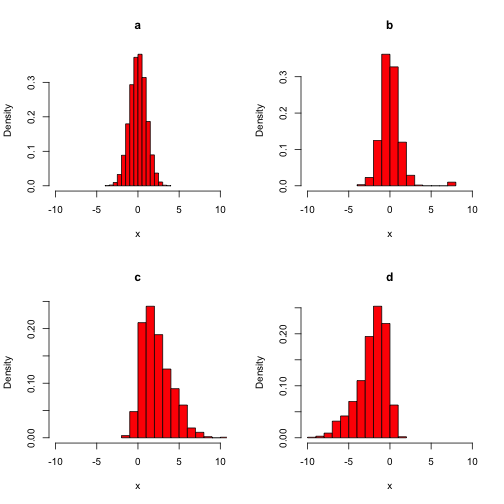

Concept tests for statistics
============================

Distribution theory
-------------------

### Problem: Exponential distribution

This problem concerns customers in a coffee shop.   Assume that we can model waiting times as an Exponential($\lambda$) distribution.   Under this model, the expected waiting time is 12 minutes.

It is now 12:20pm.   In which of the following scenarios do you expect to get served the soonest

- (a) The last customer arrived at 12:10
- (b) The last customer arrived at 12:15
- (c ) The last customer arrived at 12:00
- (d) The last customer arrived at 12:08

You may pick none, some or all.

### Comments

This problem aims to engage students around the memoryless property of the exponential distribution.   It is simple to prove that the Exponential has a memoryless problem, reasonably straightforward to show that the Exponential is the only continuous distribution family to have this property.   It may be harder to really appreciate what this means.   As a point of detail it may be necessary to explain whether $\lambda$ denotes waiting time or the reciprocal of waiting time.

Exploratory Data Analysis
-------------------------

### Problem: Measures of location

In which histogram is the median larger than the mean

 

### Comments

There are quite a few suggestions like this floating around in various books and journals.   The idea is to try to get students to understand what the histograms are telling them, rather than providing the jargon "left skew" etc.   In sport statistics for example, students often know what a right tailed distribution tells them (some players get a lot of goals, most players get a few)

Random variables and notation
-----------------------------

### Problem: Notation

The variables $Y_1, Y_2, \ldots, Y_n$ are independently and identically distributed as Normal random varables with parameters $\mu$ and $\sigma_2$.   We can write $Y_i \sim N(\mu, \sigma^2)$ where $i = 1, 2, \ldots, n$.

Now consider the random variable $\bar{Y} = \frac{Y_1 + Y_2 + \cdots + Y_n}{n}$.   What can you say about the following variances:

- (a) $Var(Y_i)$ increases with $n$
- (b) $Var(Y_i)$ decreases with $n$
- (c ) $Var(Y_i)$ is unchanged with $n$
- (d) $Var(\bar{Y})$ increases with $n$
- (e) $Var(\bar{Y})$ decreases with $n$
- (f) $Var(\bar{Y})$ is unchanged with $n$

### Comments

The question has a little to do with the concepts that can be hidden beneath notation.   It could be extended by asking about the variance of $y_i$ and $\hat{y}$

